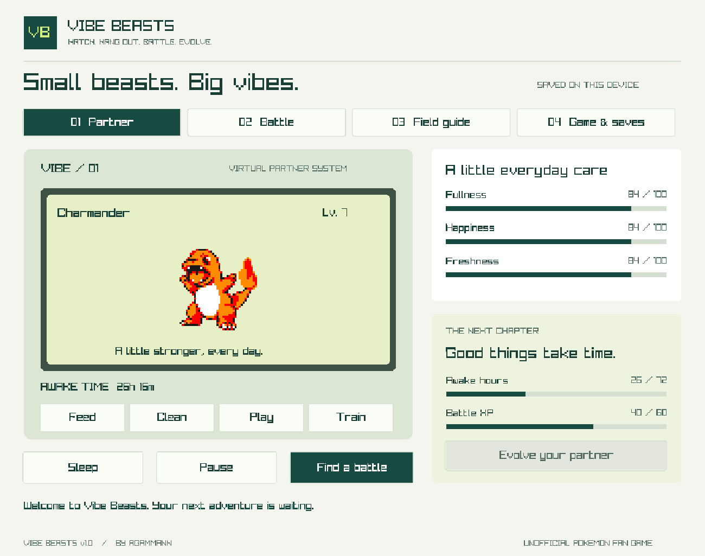

# Vibe Beasts

A little partner. A long adventure.

A free, unofficial Pokémon virtual pet by **agammann**, with original Pokémon Yellow sprites, short turn-based battles, and a C++ game engine shared by the browser and Windows versions.

**[Play in your browser](https://vibe-beasts.alx21.chatgpt.site)** · **[Download for Windows](https://github.com/agammann/vibe-beasts/releases/latest/download/Vibe-Beasts-Windows.zip)** · [Build from source](BUILD.md)

## Play

**Computer or phone:** open the browser game. Use a mouse, touch, or Tab and Enter. In **Game & saves**, wait for “Offline files downloaded” before disconnecting. Install from your browser’s app menu; on iPhone use Safari → Share → Add to Home Screen. Browser support varies. The Windows download is the independent offline option.

**Windows 10/11, 64-bit:** download the release ZIP, extract the entire folder, and double-click **Play.cmd**. No compiler, account or internet connection is needed. Optional: **Install.cmd** copies the app into your local application folder, creates a desktop shortcut and launches it. The installer needs no administrator access. Release executables are unsigned; Windows may show its normal download/reputation prompt.

The source-code ZIP is for rebuilding; choose **Vibe-Beasts-Windows.zip** for the ready-to-play game.

## Your first adventure

1. Choose a Bulbasaur, Charmander, Squirtle, Pikachu or Eevee egg.
2. Select **Set clock & hatch**. Your egg hatches after **30 awake, active seconds**.
3. Feed, clean and play with your partner. Train up to ten times for extra battle strength.
4. Visit **Battle** and start in Clover Meadow. Tackle restores focus; type bursts spend it. Guard reduces damage and restores focus. One healing berry is available per battle.
5. Win to unlock routes and more partner families. Every completed loss still awards 8 XP; retreating awards none. Partners heal after battles.
6. When both evolution requirements are met, choose **Evolve**. Eevee offers Vaporeon, Jolteon or Flareon.

## Evolution: time together, plus battles

One partner’s **full evolution chain takes 72 total hours of awake, active play**, including its 30-second hatch, provided its battle-earned level meets each requirement. Three-form families have milestones at **36 and 72 total hours**; two-form families evolve at **72 hours**. The timer runs only for your selected, hatched partner while the game is open and active. Hatching also counts toward the total. It stops during sleep, manual pause, hidden browser tabs, unfocused desktop windows, suspended devices and closed games. Time spent offline with the installed game **open and active** counts normally; time with the game closed does not.

Level evolutions use the [Gen 1 chart levels](https://pokemondb.net/evolution#evo-g1). All former stone and trade evolutions instead require **level 36**, with no items, trading or happiness checks. Eevee offers Vaporeon, Jolteon or Flareon at that same milestone. See the [complete evolution table](docs/evolution.md).

Partners start at level 5 and gain one level per 20 lifetime battle XP, up to level 100. Wins give 20/30/40/50 XP depending on the route; completed losses give 8. **Evolution preserves total awake time, lifetime XP and level**. There is no additional 72-hour wait after evolving. If you reach a time milestone before its level, keep battling; evolution remains voluntary.

Care meters never block or change evolution. There is no death or punishment for leaving. Your partner will wait. Evolution is voluntary and can be delayed indefinitely. Branch choices are permanent within a save.

These are custom fan-game rules, not a simulation of an official Pokémon game. Battles use a simplified single-type chart. **All 151 original Pokémon** are discoverable and playable across **79 partner families**, using only Pokémon Yellow sprites. No beta, prototype, glitch or later-generation Pokémon are included.

The first five families are available immediately. Caterpie unlocks at 2 wins, Pidgey at 4, Magikarp at 7, Abra at 10, and Gastly at 14. Other families unlock progressively from 2 to 24 wins. The selector shows each requirement. Every species can appear in the League, unlocked at 15 wins. Pokémon without a Gen 1 evolution remain in their original form.

## Saves

The browser saves to this browser’s local storage. Windows saves to `%LOCALAPPDATA%\VibeBeasts\partner.save`. Saves include active battles. There are no accounts or automatic cloud synchronization.

Use **Game & saves → Export save** to make a backup or move between editions. In the browser, **Import save** selects a `.save` file and asks before replacing progress. On Windows, export writes `Vibe-Beasts-export.save` beside the executable; drag a `.save` file onto the window to import, then confirm. The save format is shared across both builds.

Clearing browser data can erase your browser save and offline files. Keep exported backups. Like other local single-player games, saves are editable and are not intended for competitive rankings.

## Source & credits

The rules, timers, battles, evolution, save validation and Windows renderer are C++17. The web build uses Emscripten WebAssembly with an HTML/CSS/JavaScript interface for responsive, keyboard-accessible controls. The Windows renderer uses raylib 5.5. Build scripts and CI are included; see [BUILD.md](BUILD.md) and [verification notes](VERIFIED.md).

Pokémon Yellow sprites are archived by **[The RBY Sprites Project](https://github.com/ShiraTheMogul/rby-sprites-project)** (Plague von Karma). The images are bundled locally for offline play; original paths, hashes and the source revision are recorded in [the asset manifest](assets/sprites-manifest.json). See [CREDITS.md](CREDITS.md) for attribution and third-party terms.

Pokémon names and artwork belong to their respective rights holders. This is an unofficial fan project, with no affiliation or endorsement. Source-code permissions do not grant rights to Pokémon artwork or trademarks. No Tamaweb or DMWeb code or artwork is included.

## Removing the Windows app

The portable edition can be removed by deleting its extracted folder. For an installed copy, remove `%LOCALAPPDATA%\VibeBeasts\app` and the **Vibe Beasts** desktop shortcut. Your save remains in `%LOCALAPPDATA%\VibeBeasts`; remove that folder only if you also want to erase progress.
